<div align="center">


# Top Banana

### Describe an idea. Get a live, hosted website in about a minute.

Top Banana is a "vibe coding" hosting platform: you write a paragraph in plain
English, an LLM agent builds a self-contained static site, and it goes live on
its own subdomain — no code editor, no build step, no hosting to set up.

<br>

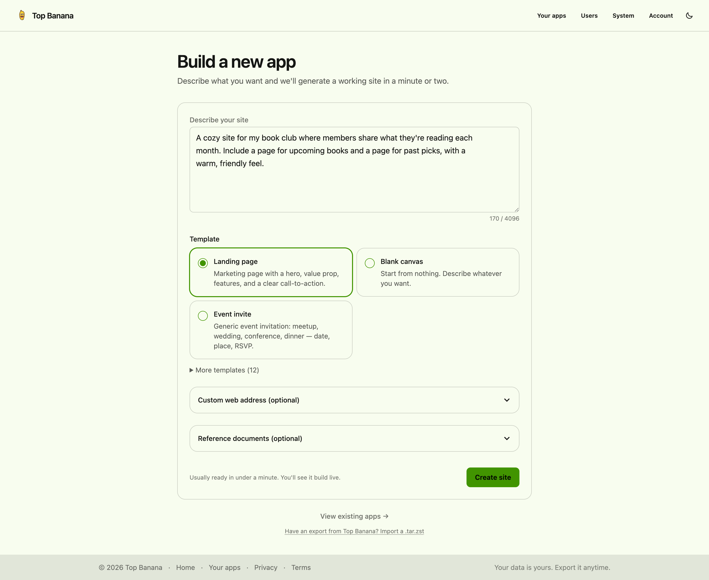

</div>

<br>

The gap between *"I have an idea"* and *"I have a URL I can send to a friend"*
should be a minute, not an afternoon. Top Banana is built for the people who
live in that gap — hobbyists, small-business owners, event organizers, club
leaders, instructors — and for developers who want a fast sketchpad for static
sites. You describe it; you get a real site; you share its address.

---

## Describe it, then watch it build

Type what you want and pick a starter template. The agent writes the HTML,
inlines the CSS and JS, lints the result, and streams its progress live — you
watch the build move from **Starting → Designing → Polishing → Ready** instead
of staring at a spinner.

<div align="center">
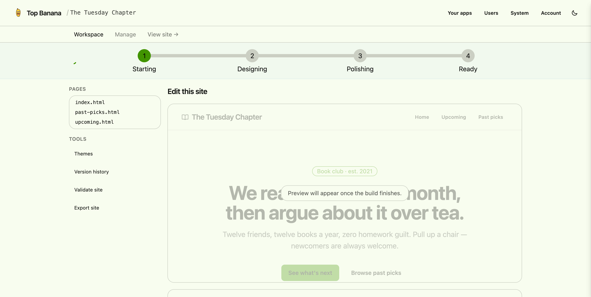
</div>

## Real sites, instantly hosted

The generated site *is* the demo. Every build lands on its own subdomain,
served straight from object storage, fully self-contained — no CDNs, no
frameworks, no external dependencies. A book club, a bistro, a portfolio, a
link-in-bio page — same prompt-to-URL path, wildly different results.

<table>
  <tr>
    <td width="50%">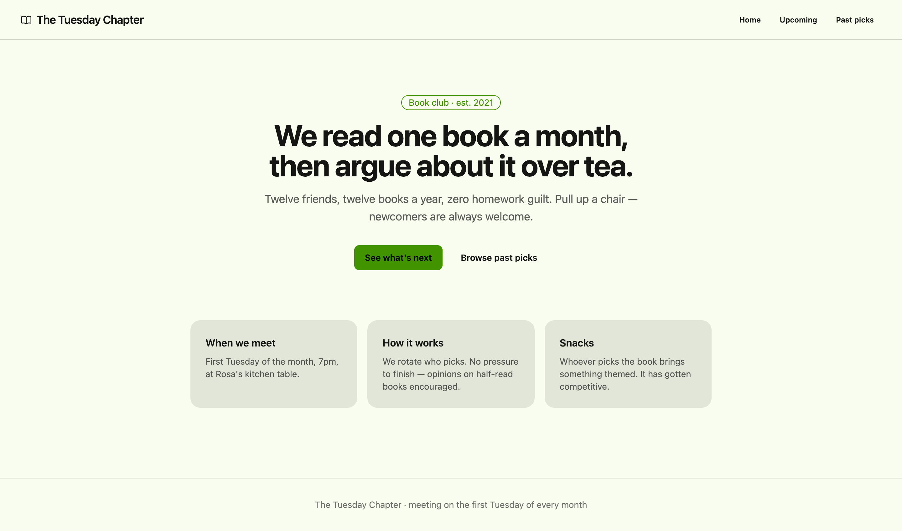</td>
    <td width="50%">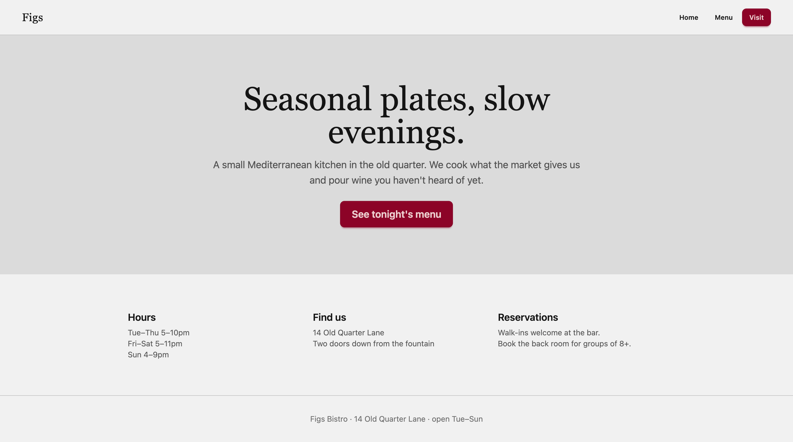</td>
  </tr>
  <tr>
    <td width="50%">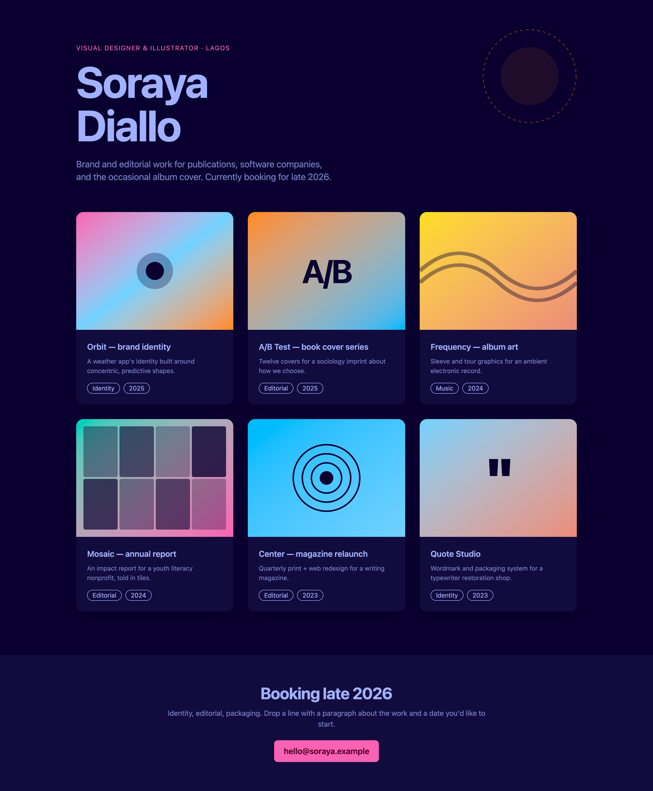</td>
    <td width="50%">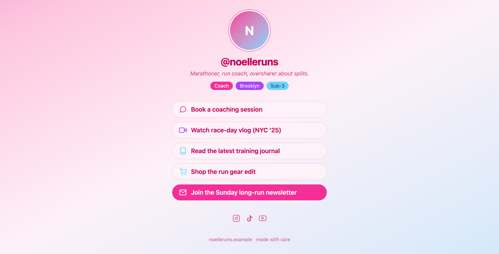</td>
  </tr>
</table>

## Edit without writing code

A site is never a dead end. The **Workspace** pairs your pages with a live
preview and an "ask for a change" box — describe an edit and the agent makes
it. **Theme Studio** restyles the whole site with one click across 30+ themes.

<div align="center">

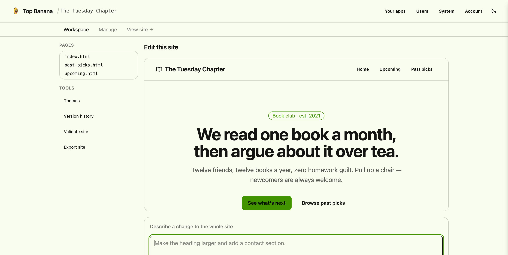

<br><br>

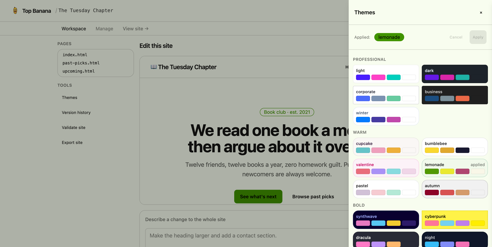

</div>

## Manage everything in one place

Your apps list shows everything you've built, last-edited at a glance. Each site
has a **Manage** surface for custom domains (with copy-paste DNS), a private
toggle, exports, and — for sites with a form — a table of submissions you can
download as CSV or JSON.

<div align="center">

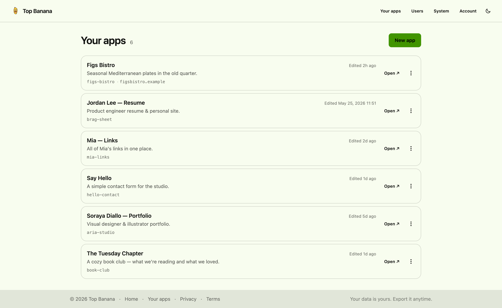

<br><br>

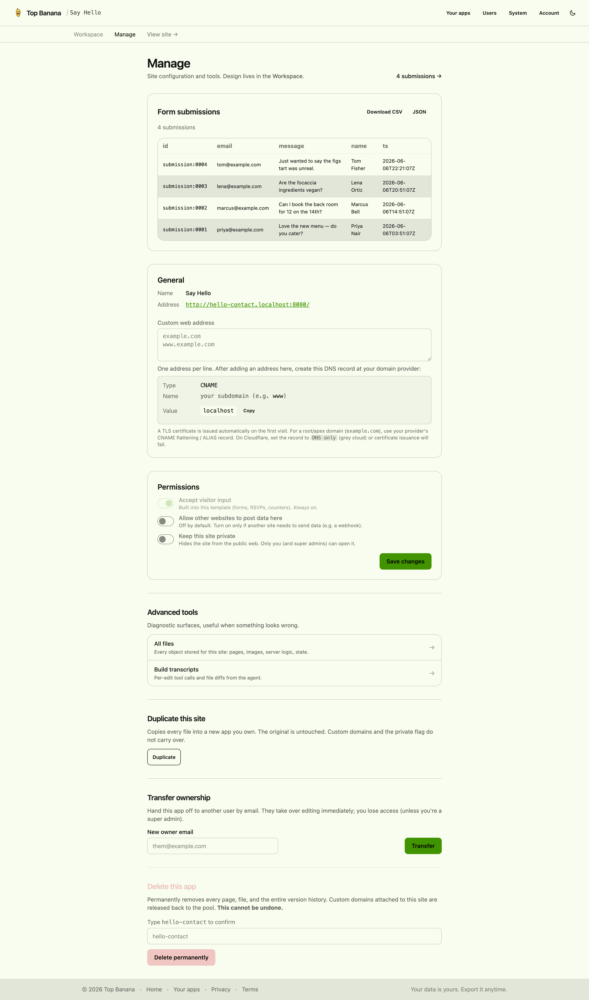

</div>

## Run it as a platform

Top Banana is multi-tenant from the ground up: passkey sign-in, per-user app
quotas, one-time invite links, and a super-admin **System** dashboard for
storage, build success rates, and recent activity.

<div align="center">

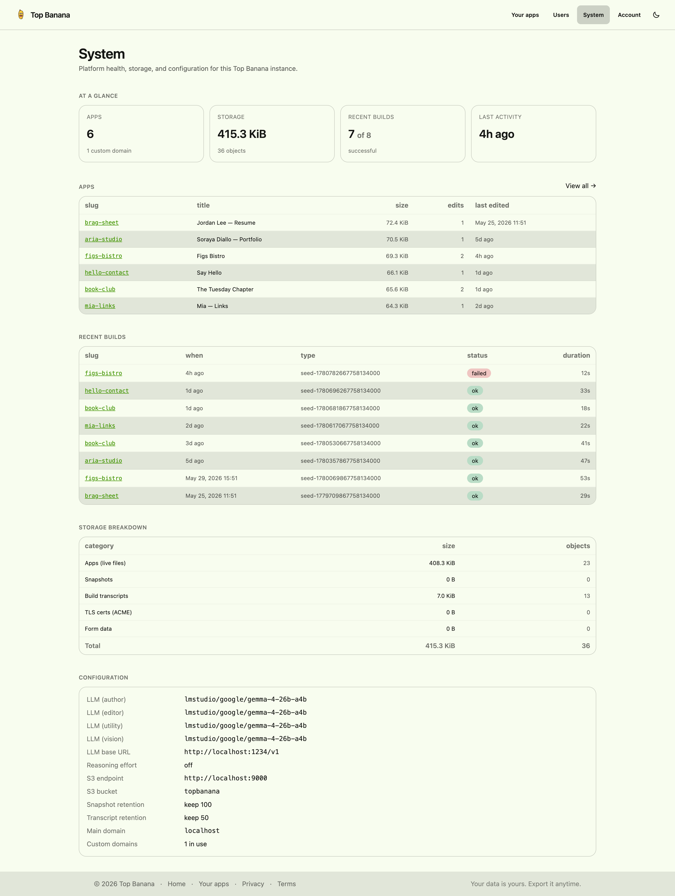

<br><br>

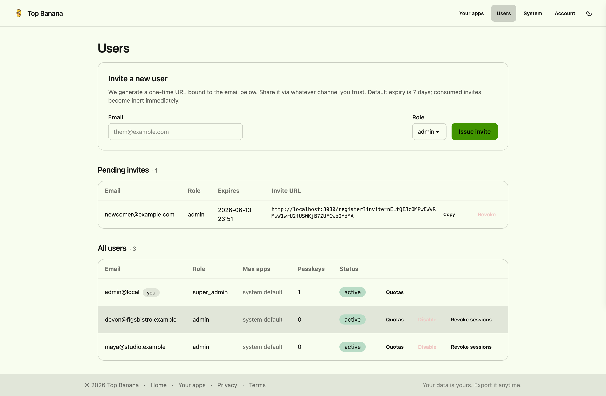

</div>

---

## How it works

1. Submit a prompt (and optionally a starter template + reference docs).
2. An LLM agent generates `.html` files — CSS and JS inlined — using S3-backed
   `write_file` / `read_file` / `list_files` tools.
3. The site is hosted immediately at `{slug}.{domain}` via subdomain routing.
4. Build progress streams live over Server-Sent Events.
5. Generated CSS is compiled per-site with a self-hosted Tailwind + daisyUI
   pipeline — no CDN tags ever ship.

## Architecture

- **Subdomain routing** — requests to `*.localhost` (or your configured domain)
  are proxied to the S3 prefix matching the subdomain slug.
- **Agentic builder** — an LLM agent with file tools, lint/retry, and a CSS
  compile step, orchestrated via Google ADK.
- **S3 storage** — AWS S3 SDK v2 with path-style addressing; Minio for local
  dev. A site "exists" if it has objects under its slug prefix.
- **Passkey auth** — WebAuthn sign-in, S3-backed sessions, invites, and
  per-user quotas.
- **HTML linting** — validates generated HTML and relative links after each
  build.

## Prerequisites

- [Go](https://go.dev/) 1.21+
- [Task](https://taskfile.dev/)
- [Minio](https://min.io/) (local S3-compatible storage)
- The [Tailwind standalone CLI](https://tailwindcss.com/blog/standalone-cli)
  (`tailwindcss` on `PATH`, or `npx @tailwindcss/cli`) for the per-site CSS
  compile
- An LLM provider — defaults to [LM Studio](https://lmstudio.ai/) at
  `http://localhost:1234/v1`

## Quick Start

```bash
# Start Minio and run the server against LM Studio
task local
```

The server starts on port `8080`. The first time, enroll the super admin (see
below) — after that you land on the build form and can start shipping sites.

### First-run: enrolling the super admin

Authentication is passkey-based — there is no admin password. On every startup
the server seeds a user record for `--super-admin-email` (defaults to
`admin@local` in `task local`) and issues a one-shot bootstrap invite the first
time that account has no registered credentials. The invite URL is logged as:

```
auth.bootstrap.invite_pending email=admin@local url=https://lvh.me/register?invite=<token> expires=...
```

For local HTTP dev, **rewrite the scheme and add the port** — turn that into
`http://lvh.me:8080/register?invite=<token>` and open it in a browser. The
`/register` page binds a passkey to the super-admin account; subsequent visits
to `/login` use that passkey. The invite is reused on every restart until you
finish enrolling, then it stops appearing in the logs.

If you ever lose the passkey, delete the user from Minio
(`rm -rf /tmp/topbanana-minio/topbanana/_auth/users/`) and restart — bootstrap
fires again.

## Configuration

All options are available as CLI flags or environment variables.

| Flag | Env Var | Default | Description |
|---|---|---|---|
| `--port` | `PORT` | `8080` | HTTP listen port |
| `--domain` | `DOMAIN` | `localhost` | Base domain for subdomain routing |
| `--super-admin-email` | `SUPER_ADMIN_EMAIL` | *(required)* | Email of the seeded super admin; bootstrap invite is logged at startup until enrolled |
| `--insecure-cookies` | `INSECURE_COOKIES` | off | Allow non-Secure cookies; required for the session flow over plain HTTP locally |
| `--s3-bucket` | `S3_BUCKET` | *(required)* | S3 bucket name |
| `--s3-endpoint-url` | `AWS_ENDPOINT_URL` | | Override S3 endpoint (e.g. Minio) |
| `--llm-model` | `LLM_MODEL` | | LLM model string |
| `--llm-base-url` | `LLM_BASE_URL` | | LLM provider base URL |
| `--llm-api-key` | `LLM_API_KEY` | | LLM provider API key |
| `--tailwind-cli` | `TAILWIND_CLI` | | Path to the Tailwind standalone binary (else `PATH` / `npx`) |
| `--cache-size` | | `1024` | ARC cache entry limit |

## Development

```bash
task fmt          # Format, lint, and test
task local        # Start app with Minio + LM Studio
task css          # Recompile the embedded admin stylesheet
task minio:start  # Start Minio in background
task minio:stop   # Stop Minio
task minio:ready  # Start Minio if not running
task test:llm     # Opt-in real-model integration tests (see below)
```

### Real-model integration tests

Every other test stubs the agent. `task test:llm` instead drives the **real**
agent loop (prompt → tools → lint/retry → CSS → describe) against a local model,
catching prompt/tool/lint-loop regressions the stubs can't. It requires LM Studio
running plus Minio, is **opt-in** (gated by `TOPBANANA_LLM_E2E=1`), is slow
(minutes), and is **excluded from the default `go test`/`task fmt` run**.
Assertions are structural invariants (build completes, `index.html` non-empty,
lint clean, a `write_file` call happened), not exact model output.

`task lmstudio:ready` loads a model with a **16K context** — this matters: the
build agent's system prompt is several thousand tokens, so the default 4096
context starves the model (it never gets room to call `write_file`). If you load
a model by hand, give it at least a 16K context.

## Custom Domains with Cloudflare

A Top Banana site can be served on any external domain (e.g. `myblog.com`) by
attaching the hostname under **Manage → Custom domains** and pointing DNS at
your origin. Putting Cloudflare in front gives you free TLS and a global cache;
Top Banana already emits the right cache headers, so the Cloudflare config is
small.

### 1. Add the domain in Top Banana

Open **Manage** for the site and add the hostnames you'll be using — one per
line:

```
myblog.com
www.myblog.com
```

Save. The server rebuilds its host → slug index immediately; requests carrying
those `Host` headers now resolve to that site.

### 2. Point DNS at your origin (Cloudflare)

In the Cloudflare dashboard for the zone:

- **Apex (`myblog.com`)** — CNAME record to your origin hostname (e.g.
  `origin.example.com`). Cloudflare flattens CNAMEs at the apex automatically.
- **`www.myblog.com`** — CNAME to the same origin hostname.
- Set **Proxy status: Proxied** (orange cloud) on both records so traffic flows
  through Cloudflare's edge.

If you're running Top Banana behind a bare IP, use `A` records instead of
`CNAME` — same idea.

### 3. SSL/TLS

Top Banana listens on plain HTTP. Terminate TLS at Cloudflare (or with a
Caddy/nginx reverse proxy on the origin):

- **SSL/TLS → Overview → Encryption mode**:
  - `Full` (or `Full (strict)`) if you put a TLS-terminating proxy in front of
    Top Banana.
  - `Flexible` if Top Banana is exposed over plain HTTP — Cloudflare ↔ visitor
    is HTTPS, Cloudflare ↔ origin is HTTP. Easier to set up; weaker than Full.
- **SSL/TLS → Edge Certificates → Always Use HTTPS**: on.

### 4. Caching

Top Banana sends explicit cache directives:

| Path on a custom domain | `Cache-Control` |
| --- | --- |
| HTML / CSS / JS / images | `public, max-age=300, s-maxage=3600` (+ `Vary: Accept-Encoding`, `ETag`) |
| `/api/*` (dynamic state) | `no-store, private` (+ `Pragma: no-cache`, `Vary: *`) |

Cloudflare's default cache only stores certain file extensions, so
extensionless URLs like `/` won't be cached unless you say so. Create **one**
Cache Rule:

- **Caching → Cache Rules → Create rule**
- **Name**: `Top Banana — respect origin headers`
- **When incoming requests match**: `Hostname` equals `myblog.com` (add a second
  `or` for `www.myblog.com`)
- **Then**:
  - **Cache eligibility**: *Eligible for cache*
  - **Edge TTL**: *Use cache-control header from origin*
  - **Browser TTL**: *Use cache-control header from origin*

That single rule is enough: Cloudflare obeys the `no-store` on `/api/*` and the
public TTL on static content.

### 5. Cache invalidation

Site edits propagate within the 5-minute `max-age` window. If you need a change
live immediately, purge from **Caching → Configuration → Purge cache**
(single-file purge by URL is enough).

## Agent Constraints

The LLM agent operates under strict rules (defined in
[internal/agent/agent_prompt.md](internal/agent/agent_prompt.md)):

- Only `.html` files — CSS and JS must be inlined
- Every site requires an `index.html` entry point
- No external CDNs or frameworks; everything self-contained
- All links between pages must use relative URLs
- The design substrate is the self-hosted `/app.css` (Tailwind + daisyUI),
  injected per-site after the build

## Code Layout

```
cmd/topbanana/      CLI entry point and configuration (Kong)
internal/server/    HTTP server, subdomain routing, admin UI, SSE build events
internal/build/     Build service, agent orchestration, per-site CSS compile
internal/agent/     LLM agent prompt and file tools
internal/auth/      Passkey auth, users, invites, S3-backed sessions
internal/store/     S3 storage abstraction with ARC cache
internal/state/     Per-site key/value state for form submissions
internal/sandbox/   Server-function (JS) execution
internal/snapshot/  Version history + export/import archives
internal/editrec/   Build transcripts (the /debug surface)
internal/lint/      HTML validation and link checking
internal/model/     LLM provider resolution (Claude, OpenAI, LM Studio)
internal/assets/    Embedded admin stylesheet + vendored daisyUI
internal/templates/ Starter site templates (prompt + skeleton + examples)
```

## Starter Templates

New sites can be bootstrapped from a template: blank, birthday, case-study,
contact-form, email-capture, event, guestbook, landing-page, link-in-bio,
portfolio, pricing, restaurant, resume, tiny-shop, and waitlist.
